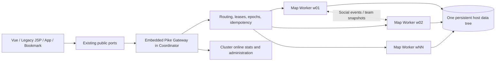

# New Moon Release: Multi-Worker World Architecture

“New Moon” marks a new architectural starting point for the Xiand server.
Instead of making one Pike process carry every map, battle, heartbeat, and AFK
loop, the world now runs on one Coordinator with an embedded Pike Gateway and
multiple map workers. Players keep using the existing URLs, bookmarks, Vue UI,
and legacy JSP UI; process boundaries remain invisible to them.

This document describes the architecture that is implemented and tested today.
It does not claim support for online worker hot-add, splitting one room across
processes, or zero-downtime upgrades.

## 1. Goals

- Preserve one continuous world: one map instance has exactly one worker owner,
  so players in that instance can meet, group, fight, and observe skill effects.
- Spread load horizontally: different map affinity groups run on different
  workers instead of sharing one Pike event loop.
- Preserve one authoritative save location: all workers use the same persistent
  host data tree; no per-worker player archive is created.
- Prevent cloning and double writes: player, equipment, currency, and reward
  mutations require owner, epoch, idempotency, and save-fence validation.
- Remain forward compatible: public ports, login entry points, `txd`, old
  bookmarks, and logical-zone identities remain stable.
- Fail closed when ownership is uncertain instead of showing partial statistics
  or replaying an economic mutation.

## 2. Runtime topology



With `N` configured workers, the core game runtime contains:

- one Pike Coordinator process; the Gateway is an embedded Pike module, not a
  separate resident Python gateway;
- `N` Pike map-worker processes;
- the existing Tomcat/Web process for legacy JSP and frontend assets.

For example, `--workers 6` starts one Coordinator/Gateway plus six map workers.
Those workers are not six isolated game realms.

## 3. Public compatibility and ports

Clients connect only to the existing public ports. Coordinator HTTP, worker
HTTP, and worker MUD ports are internal control-plane ports on loopback or the
container network and do not need to be exposed to players.

The Gateway preserves request paths, parameters, and response shapes for:

- the Vue/HTTP API client;
- legacy `main.jsp` and `legacy_api.jsp` flows;
- saved `txd` links and old bookmarks;
- existing accounts, characters, and logical-zone prefixes.

After a cross-worker move completes, the destination receives a safe view-only
refresh. The completed move, trade, or gift command is never replayed.

## 4. Map placement

The configured placement policy is `load_aware_rendezvous`. Static maps,
dynamic instances, and event spaces are normalized into affinity keys and then
assigned through a consistent choice informed by observed load.

Core invariants:

- one affinity has one owner worker at a given time;
- players in the same ordinary map converge on the same worker and can meet;
- dungeons, team instances, and timed events include an instance key, allowing
  separate instances to use separate workers;
- a logical zone is a gameplay and visibility boundary, not a process boundary;
- heat observations improve placement on the next safe cold start rather than
  moving a hot room arbitrarily while players are inside it.

Changing the worker count changes the candidate set and currently requires a
safe quiesce, save, and restart. Online hot-add is not implemented. One extremely
hot room is still owned by one worker; adding processes cannot split that room
into invisible copies.

## 5. Cross-worker player movement

A cross-worker move uses a controlled handoff:

1. The Gateway selects the target worker from the destination affinity.
2. The Coordinator advances the player's lease epoch and issues a one-time
   handoff capability.
3. The source saves transferable state; the target validates identity, epoch,
   map, and process incarnation before accepting it.
4. The source releases its old player object only after destination arrival is
   acknowledged.
5. A timed-out request enters reconciliation; a possibly completed write is not
   replayed blindly.

Players normally perceive only an ordinary page refresh. If the handoff cannot
be proven, it fails safely or waits for recovery; two workers cannot both become
valid owners of the same player.

## 6. Persistence, uniqueness, and anti-cloning

Player archives retain one authoritative storage location: the persistent host
directory. Rebuilding the container, changing worker count, or moving between
maps does not create a second user directory.

Protection layers include:

- Coordinator-owned player routing and monotonically changing epochs;
- worker process incarnations, preventing results from a replaced process from
  impersonating its successor;
- player-level and account-level transaction locks;
- idempotent receipts for requests, item grants, recharge operations, and social
  events;
- control-lease and player-epoch fences before saves;
- a shutdown barrier that pauses routing, drains accepted and background work,
  and only then authorizes worker saves.

If any ownership proof is incomplete, saving or economic mutation is rejected.
Do not kill and delete a running container in place of
`restart-all-docker.sh`.

## 7. Cross-worker features

The current architecture routes or durably relays:

- private messages, world broadcasts, team invitations, and team snapshots;
- friend teleport and controlled cross-worker arrival;
- administrator player lookup, item grants, recharge, and account-cache refresh;
- cluster-wide online totals, player lists, and per-worker distributions;
- globally serialized economic commands such as auction operations.

After a complete monitor pass, the Gateway captures online rows from all workers
in parallel. Each response is bound to the exact worker incarnation. Only a
complete set atomically replaces the previous cache; every player is then
checked against the Coordinator owner and epoch before the snapshot is published
to all workers in parallel. A migration race may trigger up to three short
retries, but partial rows are never presented as success. Health checks require
a published snapshot with no error and an age of at most 30 seconds.

## 8. Logical zones and future seasons

Existing logical zones remain active. They govern identity, visibility, combat,
events, rankings, and selected economic rules, while multiple logical zones may
share one physical worker pool.

This supports a two-layer seasonal model:

- physical layer: realms share the Coordinator, Gateway, and worker pool for
  better utilization;
- gameplay layer: seasonal, classic, or isolated realms remain separated by
  logical-zone rules.

An internally unified large world therefore does not remove product-level realm
or season boundaries.

## 9. Configuration and deployment

Version-controlled deployment inputs are:

- `deploy/map_workers/config.json`: the deployment baseline;
- `deploy/map_workers/config.example.json`: the field template;
- `.env.example`: the environment template, without real passwords or worker
  tokens.

Production one-command startup example:

```bash
./restart-all-docker.sh --force-active --workers 6
```

The script preserves secret values from the existing `.env`, synchronizes the
Git worker configuration into persistent host storage, safely quiesces and saves
the old workers, starts the unified container, and waits for the Coordinator,
all workers, public Gateway, and online snapshot to pass health checks.

Local real-runtime validation:

```bash
./restart-local-workers.sh --workers 3
scripts/map_worker_cluster.sh status
scripts/map_worker_cluster.sh health
```

Changing worker count is not a hot operation. Use the same safe restart flow in
production. Do not edit persistent `config.json` during play and manually launch
an extra process.

## 10. Modes, recovery, and rollback

- `shadow`: workers and the control plane can run while public traffic remains
  authoritative on the legacy main process.
- `active`: the public Gateway routes requests to map workers.
- `--force-active`: explicitly requests an active cold start; it does not bypass
  save, identity, or health proofs.
- fallback latch: records an unproven failure and prevents oscillation between
  two authorities.

The Coordinator/Gateway can be recovered independently while workers remain
healthy. If worker identity, leases, or save state cannot be proven, the system
stays fail-closed. The legacy single-process startup remains the architectural
rollback path.

## 11. Operations and observability

Monitor:

- `scripts/map_worker_cluster.sh health`;
- Gateway `controller_ready`, `routing_ready`, and `worker_requests`;
- `online_snapshot_age`, `online_snapshot_error`, and per-worker online counts;
- `pending_requests`, `uncertain_requests`, and `pending_reconcile_users`;
- worker queue wait, command latency, heartbeat, save latency, and fence blocks;
- `log/stderr.<coordinator-port>` and process logs under
  `log/map-workers/<area>/`.

Logs must not contain passwords, complete tokens, player archive contents, or
reversible credentials. Production logs must be sanitized before local analysis.

## 12. Acceptance criteria

Every change to the multi-worker foundation must:

1. add Pike TestUnit or shell coverage for each new invariant;
2. run startup, quiesce, old-container retry, and bootstrap tests;
3. perform a full local restart so TestUnit runs in the real game environment;
4. start at least three workers and pass `status`, `health`, and log inspection;
5. verify same-map ownership, cross-worker movement, unique persistence, social
   operations, administration, and safe shutdown;
6. remain on a trial branch long enough to observe stability before mainline
   merge.

The New Moon principle is straightforward: grow the world without sacrificing
save uniqueness, economic consistency, or old-player entry points.
