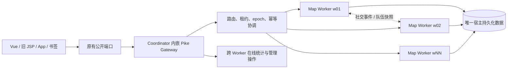

# 新月版本：多 Worker 世界架构

“新月”代表仙道服务器架构的新起点。从本版本开始，世界不再由一个 Pike
进程独自承担全部地图、战斗和挂机负载，而由一个内嵌 Pike Gateway 的
Coordinator 和多个地图 Worker 协同运行。玩家仍使用原来的网址、书签、
Vue 页面和旧 JSP 页面；进程划分对玩家透明。

本文描述当前已经实现并通过测试的架构边界。它不承诺尚未实现的热扩容、
单房间拆分或无停机升级。

## 1. 设计目标

- 保持一个连续世界：同一地图实例始终只归一个 Worker，同图玩家可以相遇、
  组队、战斗和看到技能表现。
- 横向分担负载：不同地图亲和组分布到不同 Worker，减少单 Pike 进程承担的
  心跳、挂机、房间和命令压力。
- 保持唯一存档：所有 Worker 使用同一套宿主持久化目录，不创建多份用户档案。
- 防止克隆与双写：人物、装备、货币和奖励写入必须经过 owner、epoch、请求幂等
  和存档 fence 校验。
- 向前兼容：对外端口、登录入口、`txd`、旧书签和逻辑区身份保持不变。
- 失败时宁可拒绝不确定操作，也不返回残缺统计或重复执行经济写入。

## 2. 运行拓扑



当配置为 `N` 个 Worker 时，容器内的核心游戏部分为：

- 1 个 Pike Coordinator 进程；Gateway 作为 Pike 模块内嵌其中，不存在独立的
  Python Gateway 常驻进程。
- `N` 个 Pike 地图 Worker 进程。
- 原有 Tomcat/Web 进程继续服务旧 JSP 和前端资源。

例如 `--workers 6` 表示 1 个 Coordinator/Gateway 加 6 个地图 Worker，
而不是 6 个彼此隔离的游戏区。

## 3. 对外兼容与端口

客户端只连接原来的公开端口。Coordinator HTTP、Worker HTTP 和 Worker MUD
端口均为容器或宿主回环网络中的内部控制面端口，不需要向玩家开放。

Gateway 保留请求路径、参数和响应形态，因此以下入口继续兼容：

- 新 Vue/HTTP API 客户端；
- `main.jsp`、`legacy_api.jsp` 等旧 JSP 流程；
- 已保存的 `txd` 和老书签；
- 原有注册账号、人物和逻辑区前缀。

跨 Worker 移动完成后，只在目标 Worker 执行安全视图刷新，不重放已经完成的
移动、交易或赠送命令。

## 4. 地图如何分配

配置中的 `placement` 为 `load_aware_rendezvous`。系统先把静态地图、动态副本和
活动空间归一化为 affinity key，再使用带负载信息的一致性选择分配 Worker。

关键不变量：

- 同一 affinity 在同一时刻只有一个 owner Worker。
- 同一普通地图的玩家会集中到同一个 Worker，因此可以真实见面。
- 副本、队伍实例和限时活动使用实例键隔离；不同实例可以落到不同 Worker。
- 逻辑区是玩法与可见性边界，不再等同于物理进程边界。
- 热度数据用于下一次安全冷启动时改善地图分布，不在玩家在线时随意搬迁整个
  热点房间。

增加 Worker 会改变候选集合，当前必须经过安全停流、存档和重启后生效；尚未
实现在线热加 Worker。单个极热房间仍只能由一个 Worker 承载，不能靠增加进程
把同一个房间拆成多个互不可见副本。

## 5. 人物跨 Worker 移动

一次跨 Worker 移动遵循受控交接：

1. Gateway 根据目标地图 affinity 选择目标 Worker。
2. Coordinator 在人物租约上推进 epoch，并生成一次性交接能力凭据。
3. 源 Worker 保存可迁移状态；目标 Worker 校验身份、epoch、地图和进程
   incarnation 后接收。
4. 目标到达得到确认后，源 Worker 才释放旧人物对象。
5. 超时请求进入 reconciliation，不会盲目重放可能已经成功的写命令。

玩家通常只感知一次普通页面刷新。交接失败时请求会安全失败或等待恢复，不允许
同一人物同时成为两个 Worker 的有效 owner。

## 6. 存档、唯一性与防克隆

用户档案仍只有一个权威存储位置：宿主机持久化目录。容器重建、Worker 数变化或
人物跨图都不会创建另一套用户目录。

防护层包括：

- Coordinator 的人物 owner 与递增 epoch；
- Worker 进程 incarnation，防止重启后的旧进程结果冒充新进程；
- 人物与账号级事务锁；
- 请求 ID、发物 ID、充值 ID 和社交事件 ID 的幂等回执；
- 存档前的 control lease 与 player epoch fence；
- 安全停服时先停流、等待已接收请求和后台交接收敛，再让 Worker 存档。

任一所有权证明不完整时，系统拒绝保存或执行经济写入。不要绕过
`restart-all-docker.sh` 直接杀死并删除运行中的容器。

## 7. 跨 Worker 功能

当前架构把下列能力纳入统一路由或持久事件通道：

- 私聊、世界广播、队伍邀请与队伍快照；
- 好友传送和受控跨 Worker 到达；
- 管理员查找玩家、发放物品与充值后的账号缓存刷新；
- 跨 Worker 在线人数、在线列表和每个 Worker 的人数分布；
- 拍卖等需要全局串行化的经济命令。

在线列表由 Gateway 在完整监控轮次后独立并行抓取。每份结果绑定 Worker 的
incarnation，全部成功后才原子替换；随后逐人物核对 Coordinator 的 owner 和
epoch，并并行发布到所有 Worker。迁移瞬间允许最多三次短重试，但不会用残缺名单
冒充成功。健康检查同时要求在线快照已发布、错误为空且年龄不超过 30 秒。

## 8. 逻辑区与未来赛季

原有逻辑区继续生效。它决定身份、可见性、战斗、活动、排名和部分经济规则，
但多个逻辑区可以由同一组 Worker 承载。

这为未来赛季提供两层模型：

- 物理层：所有区共享 Coordinator、Gateway 和 Worker 池，提高整体利用率。
- 玩法层：赛季区、经典区或隔离区仍按逻辑区规则互相不可见。

因此“内部合在一个庞大世界”不等于取消产品侧的区服或赛季规则。

## 9. 配置与部署

版本控制中的部署配置位于：

- `deploy/map_workers/config.json`：实际部署基线；
- `deploy/map_workers/config.example.json`：字段模板；
- `.env.example`：环境变量模板，不包含真实密码或 Worker token。

生产一键启动示例：

```bash
./restart-all-docker.sh --force-active --workers 6
```

脚本会保留旧 `.env` 中的秘密值、同步 Git 中的 Worker 配置到宿主持久目录、
安全停流并保存旧 Worker、启动统一容器，然后等待 Coordinator、全部 Worker、
公开 Gateway 和在线快照共同通过健康检查。

本地真实环境测试：

```bash
./restart-local-workers.sh --workers 3
scripts/map_worker_cluster.sh status
scripts/map_worker_cluster.sh health
```

修改 Worker 数量不是热操作。生产环境使用同一重启命令完成安全重映射；不要在
运行中手工修改持久化 `config.json` 后单独启动一个进程。

## 10. 模式、恢复与回滚

- `shadow`：控制面和 Worker 可试运行，但公开流量仍由旧主进程承担。
- `active`：公开 Gateway 将请求路由到地图 Worker。
- `--force-active`：明确要求 active 冷启动；它不会绕过存档、身份或健康证明。
- fallback latch：记录一次无法证明安全的失败，避免反复在两套权威之间摆动。

Coordinator/Gateway 可在 Worker 仍健康时独立恢复。若 Worker 身份、租约或存档状态
无法证明，系统保持 fail-closed；旧单进程启动流程仍是架构级回滚路径。

## 11. 运维观察

重点检查：

- `scripts/map_worker_cluster.sh health` 是否通过；
- Gateway 的 `controller_ready`、`routing_ready`、`worker_requests`；
- `online_snapshot_age`、`online_snapshot_error` 和每 Worker 在线分布；
- `pending_requests`、`uncertain_requests`、`pending_reconcile_users`；
- Worker 的队列等待、命令耗时、心跳、存档耗时和 fence 拒绝计数；
- `log/stderr.<coordinator-port>` 与 `log/map-workers/<area>/` 下各进程日志。

日志不得输出密码、完整 token、玩家存档内容或可逆凭据。生产日志应先脱敏再用于
本地分析。

## 12. 验收标准

每次修改多 Worker 基础层都必须：

1. 为新不变量增加 Pike TestUnit 或脚本测试；
2. 运行启动、停流、旧容器重试和 bootstrap 测试；
3. 执行完整本地重启，让 TestUnit 在真实游戏环境中运行；
4. 启动至少 3 个 Worker 并通过 `status`、`health` 和日志检查；
5. 验证同地图同 Worker、跨 Worker 移动、唯一存档、社交、管理与安全停服；
6. 先在测试或试运行分支观察，再决定是否合并主线。

新月版本的原则很简单：扩大世界，但不牺牲存档唯一性、经济一致性和老玩家入口。

